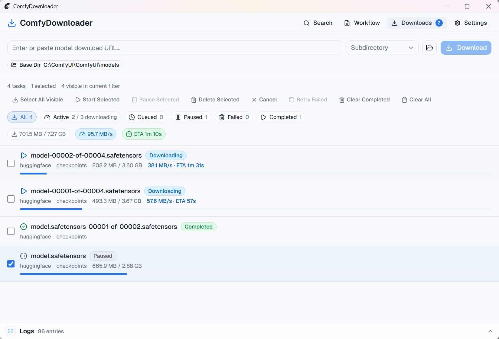
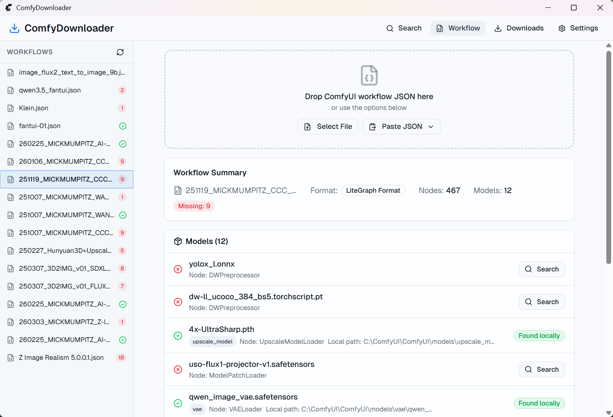
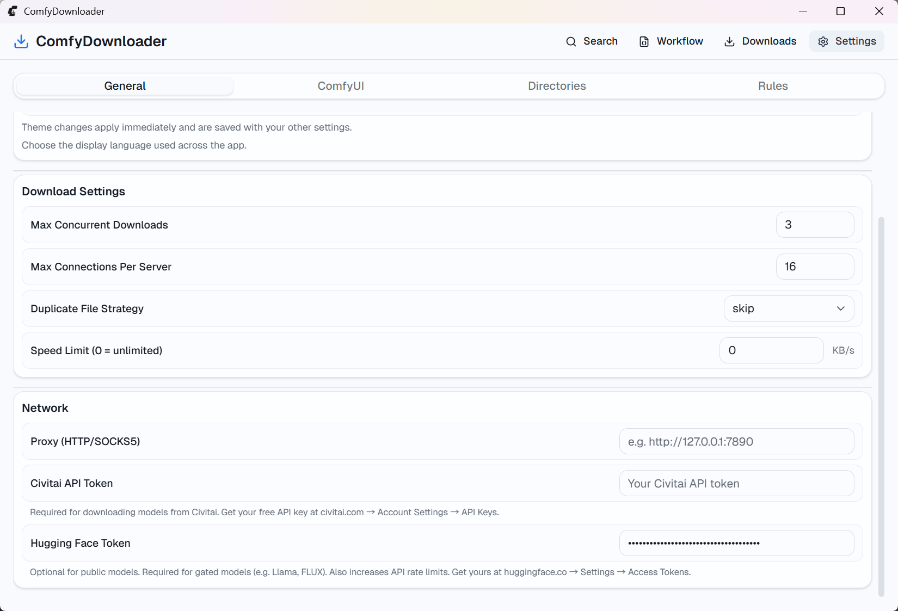

# ComfyDownloader

[English](README.md)

一个基于 aria2 的桌面应用，用于将 AI 模型下载到正确的 ComfyUI 目录中。

[](https://github.com/mogurt/ComfyDownloader/actions/workflows/ci.yml)
[](https://github.com/mogurt/ComfyDownloader/releases)
[](LICENSE)

## 为什么做这个项目

ComfyDownloader 主要解决 ComfyUI 使用过程中最繁琐的那一段：找到模型、判断模型类型、选择正确目录、可靠下载。

相比在浏览器、模型页面和本地文件夹之间来回切换，这个应用更关注一条更顺手的流程：

- 在一个桌面应用里同时搜索 Hugging Face 和 Civitai
- 解析 URL 并推荐正确的 ComfyUI 模型类型
- 自动路由到合适的模型目录
- 用 aria2 管理可恢复下载
- 解析 workflow 文件并检查本地缺失模型

## 截图

### 搜索


### 下载



### Workflow



### 设置



## 功能特性

- **智能 URL 解析** - 自动从 Civitai、Hugging Face 和直链中提取文件名与元数据
- **模型类型推荐** - 根据文件名、URL 和来源 API 元数据推荐正确的模型类型
- **目录映射** - 自动将下载内容路由到正确的 ComfyUI 模型子目录
- **aria2 下载引擎** - 支持并发、断点续传与实时进度追踪
- **重复文件检测** - 下载前检查目标文件是否已存在
- **批量导入** - 支持通过文本或文件一次导入多个 URL
- **自定义规则** - 通过关键字规则自动分类模型类型
- **代理支持** - 支持 HTTP/SOCKS5 代理，便于在受限网络环境下下载
- **ComfyUI 集成** - 校验模型是否已被运行中的 ComfyUI 识别
- **Workflow 解析** - 分析 ComfyUI workflow JSON，并检查本地缺失的模型

## 快速开始

1. 从 [Releases](https://github.com/mogurt/ComfyDownloader/releases) 下载最新版本。
2. 打开应用，配置 `ComfyUI root` 或 `model base directory`。
3. 粘贴模型 URL，或直接从 Hugging Face / Civitai 搜索。
4. 确认推荐的模型类型和目标目录。
5. 开始下载，并在 Downloads 页面查看进度。

## 平台支持

当前提供以下预编译二进制：

- macOS（Apple Silicon，`aarch64`） - `.dmg`
- macOS（Intel，`x86_64`） - `.dmg`
- Windows（`x86_64`） - `.msi` / `.exe`

Linux 打包已在规划中，但短期内尚未正式支持。

每个 release 还会附带一个 `SHA256SUMS.txt` 文件用于校验产物。

> 当前发布产物**尚未代码签名**。首次启动前请先阅读下方说明。

### 校验下载文件（SHA256）

```bash
# macOS / Linux
shasum -a 256 ComfyDownloader_*.dmg

# Windows (PowerShell)
Get-FileHash .\ComfyDownloader_*.msi -Algorithm SHA256
```

将输出结果与 `SHA256SUMS.txt` 中对应条目进行比对即可。

### macOS / Windows 首次启动

由于项目目前没有使用 Apple Developer ID 签名或 Windows EV 证书，操作系统在首次启动时可能会弹出安全提示。所有二进制均由 GitHub Actions 基于本仓库构建，你可以在 [`release.yml`](.github/workflows/release.yml) 中查看对应流程。

**macOS** - 如果出现 _"ComfyDownloader is damaged and can't be opened"_ 或 _"Apple cannot check it for malicious software"_，通常是 Gatekeeper 拦截了未签名应用，并不代表 DMG 文件损坏。

1. 将 `ComfyDownloader.app` 拖到 `Applications`
2. 运行：

```bash
xattr -dr com.apple.quarantine /Applications/ComfyDownloader.app
```

3. 再次打开应用

也可以右键应用并选择 **Open**。

**Windows** - 如果 SmartScreen 提示 _"Windows protected your PC"_，点击 **More info** -> **Run anyway**。

## 技术栈

- **前端**：React 19 + TypeScript + Tailwind CSS v4 + shadcn/ui
- **后端**：Tauri v2（Rust）
- **下载引擎**：aria2c（内嵌 sidecar）
- **数据库**：SQLite（通过 `tauri-plugin-sql`）
- **状态管理**：Zustand

## 开发

### 环境要求

- [Node.js](https://nodejs.org/) >= 20
- [Rust](https://rustup.rs/) >= 1.77
- Windows 10+ 或 macOS

### 本地启动

```bash
# 安装依赖
npm install

# 如有需要，重新准备 aria2c（需先删除 src-tauri/binaries/aria2c-*）
npm run prepare:aria2

# 启动 Vite + Tauri
npm run tauri dev

# 构建生产应用
npm run tauri build
```

`npm install` 会基于固定版本的 aria2 官方发布，自动在 `src-tauri/binaries/` 下准备所需的 `aria2c` sidecar：Windows 直接下载官方构建；macOS 从官方源码编译，需要先安装 Xcode Command Line Tools，首次约需几分钟。如需使用自己的二进制，可在运行 `npm run prepare:aria2` 前设置 `ARIA2C_PATH`。目前自动准备仅覆盖 Windows 和 macOS。

常用检查命令：

```bash
npm run lint
npm run typecheck
npm test
cd src-tauri && cargo clippy --all-targets -- -D warnings
cd src-tauri && cargo test
```

## 安全说明

- Hugging Face 与 Civitai 的访问 Token 当前会保存在本地 SQLite 设置数据库中，请不要复用高权限 Token。
- 当前 release 产物尚未代码签名，首次运行前请先校验 checksum。
- 安全相关问题请按 [`SECURITY.md`](SECURITY.md) 中的方式私下反馈，不要直接公开提 issue。

## 许可证

ComfyDownloader 本体采用 [MIT License](LICENSE) 发布。

项目以 sidecar 形式内嵌了 `aria2c` 作为下载引擎。`aria2c` 采用
[GNU GPL v2.0 或更高版本](https://github.com/aria2/aria2/blob/master/COPYING)
许可，版权归其上游作者所有。完整的第三方组件清单与许可证信息请见
[`THIRD_PARTY_NOTICES.md`](THIRD_PARTY_NOTICES.md)。

## 项目结构

```text
src/                    # React 前端
  components/           # UI 组件
  pages/                # Downloads、Search、Workflow、Settings
  stores/               # Zustand 状态管理
  hooks/                # 自定义 React hooks
  lib/                  # 类型、API 封装与工具函数

src-tauri/              # Rust 后端
  src/
    aria2/              # aria2 进程管理与 RPC 客户端
    commands/           # Tauri command 处理器
    url_parser/         # Civitai、Hugging Face 等 URL 解析
    model_type/         # 模型类型推荐引擎
    db/                 # SQLite 迁移
  binaries/             # aria2c sidecar 二进制
```

## 路线图

- 继续完善公开发布所需的 release 体验
- 扩展 workflow 解析能力，覆盖更多 ComfyUI 节点模式
- 改进 Token 与本地敏感信息存储方式
- 增加官方 Linux 打包支持
- 补充更完整的截图与上手文档

## 贡献

欢迎各种贡献，包括 bug 修复、workflow parser 改进，以及 i18n 翻译补充。

- 日常贡献默认从 `dev` 分支开始
- 推荐使用 Conventional Commits（如 `feat:`、`fix:`、`docs:`、`chore:`）
- 对于比较直接的小改动，不强制要求先开 issue

更多信息可见 [`CONTRIBUTING.md`](CONTRIBUTING.md)、[`SECURITY.md`](SECURITY.md) 和 [`CODE_OF_CONDUCT.md`](CODE_OF_CONDUCT.md)。
